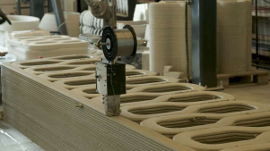
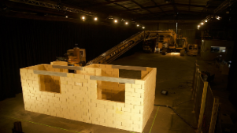

# Q.Will AI replace humans in the world and especially in the field of civil engineering?

### A._My answer to this question is_ *YES* _but nobody of us cannot predict how it will happen._

## Here are some of my views and expert's opnions

As technology is developing with the speed of light because of nuetral minded millenial we call her Internet. Artificial Intelligence is one of the baby of her. In deep example in early 1700's India used to produce cotton then Indian used to make cotton threads and clothes from it using man power but all of sudden due to establishment of cotton mills in Europe it can produces very fast and cost effective cotton products by purchasing raw cotton from India. If we deeply have a look at this scenario machines replaced human's who uses their hands to work but demand for people who use their hand to operate machines have increased enormously. Expert says same thing is happening here but for a change people who use their hands to operate machines which operates other machines is increasing.

## Now comes the turn of civil engneering 

### Machines created a very leass impact on civil engineering when compared to other fields of engineering but the new AI can replace labour workers in construction industry because most labour work is operating machines and it can be done automatic by AI like brick laying and construction using 3D printing.  
 

# *Now I got a doubt that will AI replace civil engineers?*

*A.*_Probably no because all the AI technology which is under innovation for civil engineering is leaning towards making the manual work done by civil engineers automatic and getiing much faster and precise data._

* Advantages
  
   * Finish the project more efficient.
   * Finishing the project as soon as possible.
   * Predictions become more accurate

* Disadvantages

   * Adoptation requires time.
   * It needs some more extra effort to find the minor issues in the project because of its fast it becomes too late to find mistakes. In some situations minor mistakes leads to significant losses. 
   * Staff morale. 

## *References*   

[Will robo's replace civil engineers?](https://academy.archistar.ai/will-architects-and-engineers-be-replaced-by-robots)

[Artificial Intelligence: Is it the fourth Industrial Revolution?](https://medium.com/mmc-writes/the-fourth-industrial-revolution-a-primer-on-artificial-intelligence-ai-ff5e7fffcae1)

*Some Random Youtube videos*

